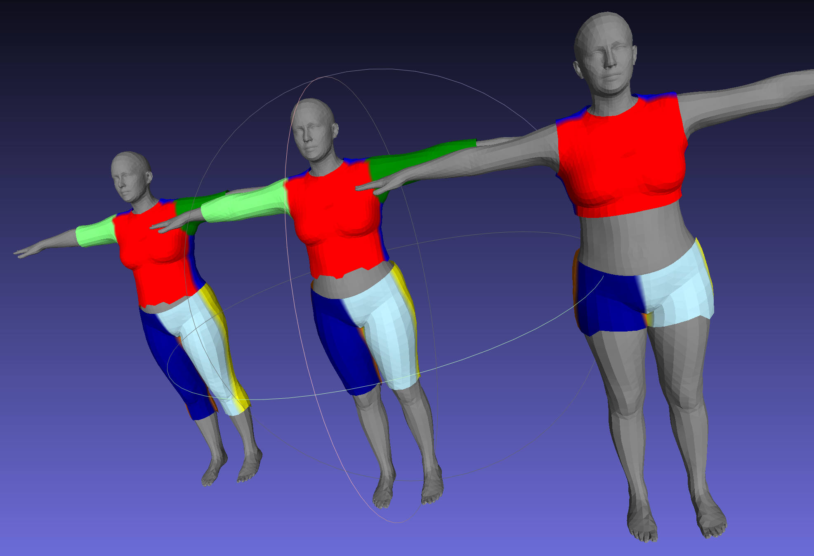

# TailorLang

TailorLang is the first DSL for parametric clothing with accurate cloth fitting. The project is motivated by the fact there is still no way to accurately determine how a piece of fabric fits the 3D body.
The central result for solving the fitting problem is to find "characteristic" pieces of fabric that fit specified body areas. As part of the TailorLang, the algorithm for finding the characteristic pieces
of fabric will be implemented.

This is an ongoing project.

## Roadmap

- [X] Select the corresponding SMPL area based on specified (fixed) seam indices

- [ ] Generate a characteristic 3D grid for a specified body area

- [ ] Calculate characteristic 2D piece(s) of fabric corresponding to the specified body area(s)

- [X] Control the sizes of 3D garment components

- [ ] Control the sizes of 2D garment components

- [ ] Fit a given 2D piece of fabric to a given 3D body part

- [ ] Fit specified garments to a 3D body

- [ ] Control the sizes of 3D and 2D garment pieces simultaneously

- [ ] Transfer garments from one 3D body to another, keeping the original garment sizes

- [ ] Define and create a markup file implementing DSL for TailorLang

- [ ] Support adding darts

- [ ] Automatically find a perfect fit using characteristic garments and darts

- [ ] Transfer garments from one 3D body to another, keeping the garment sizes and dart locations

## Contributing

Please reach out to one of my email addresses kristijan.bartol@gmail.com or kristijan.bartol@tu-dresden.de.
